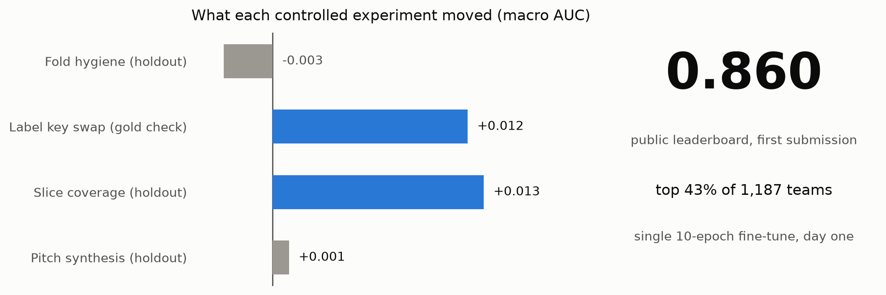
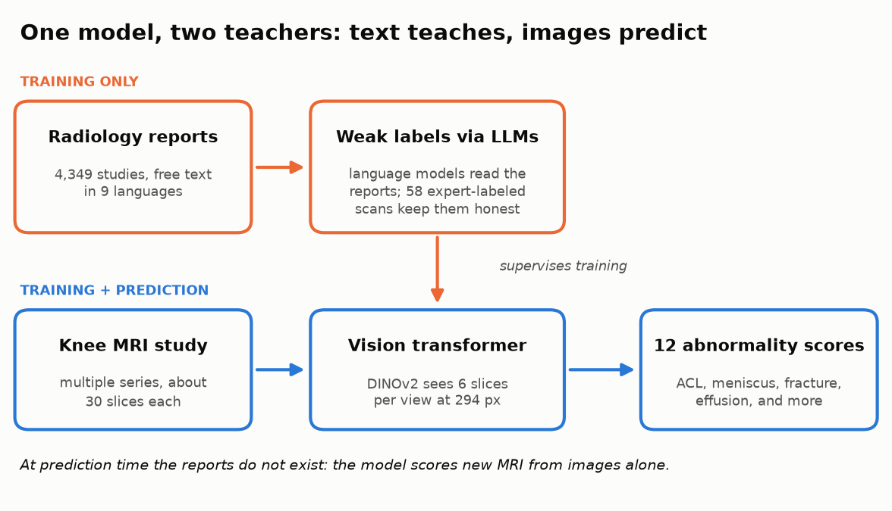
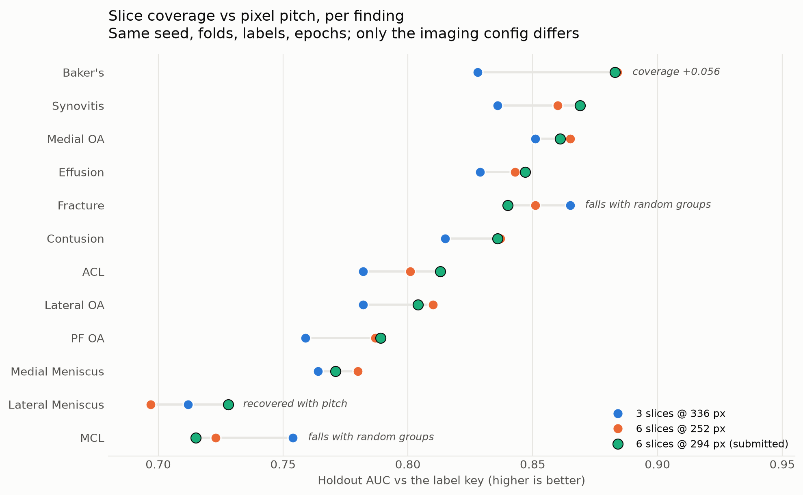

# RSNA Knee Abnormality Detection: a controlled-experiment lab notebook

One day of measured, single-variable experiments on the
[RSNA Knee Abnormality Detection](https://www.kaggle.com/competitions/rsna-knee-abnormality-detection)
Kaggle challenge: detecting twelve clinically important abnormalities on knee MRI,
where only 58 of 4,407 training studies carry expert labels and the rest must be
supervised from multilingual radiology reports.

**First submission: public leaderboard 0.860 (macro AUC), top 43% of 1,187 teams,**
from a single 10-epoch fine-tune of a general-purpose DINOv2 checkpoint, using none
of the competition-trained weights the public 0.899 cluster runs. The gap to that
cluster is training budget and recipe, not label quality: every run here was kept
short and identical so that exactly one variable moved per experiment.

**Author:** Stephen D. Gardner, U.S. Navy veteran and AI product founder.

## Why this problem

This one is personal. I dealt with knee injuries during and after my own Navy
service, so I know firsthand how much rides on how quickly and consistently a knee
gets evaluated. The knee is the most injured and most imaged joint in the body: per the
competition overview, knee injuries account for an estimated 15 to 40 percent of
all sports-related trauma, and
musculoskeletal injury is a leading readiness concern for service members, whose
careers, like athletes' careers, can turn on a scan. Access to subspecialty
musculoskeletal radiologists is limited outside major medical centers. Models that
read knee MRI reliably are a decision-support path to faster, more consistent care
for exactly these populations. This project is independent work on a public research
challenge; it is not affiliated with the military or any sports organization.

## The five experiments

Every run held seed, epochs, folds, and labels fixed except for the one variable
under test. Full data, methods, and honest caveats in
[docs/competition/COMPETITION_CONTEXT.md](docs/competition/COMPETITION_CONTEXT.md).

| # | Experiment | Result | Finding |
|---|---|---|---|
| 1 | Dual-grouped CV folds (report dedupe + scanner) vs upstream md5 split | -0.003 | The measured 0.05 metadata leak does NOT transfer to a pixel model; a negative result refuting a popular inference |
| 2 | Hybrid label key (v4_blend + v2 Fracture column) vs v2 key | +0.012 annot | Better weak labels transfer to the model, at about a third of the key-side magnitude |
| 3 | Slice coverage: 6 slices/slot @ 252 px vs 3 @ 336 px | +0.013 | Coverage pays broadly; the thinnest structures declined, a reading experiment 4 then revised |
| 4 | Synthesis: 6 slices @ 294 px (Nyquist-safe pitch) | +0.001, new best | Lateral Meniscus recovers with pitch; MCL and Fracture isolate a third mechanism, multi-instance label dilution |
| 5 | First submission (kernel v5) | public 0.860 | The 10-gold internal check was pessimistic; the 390-study public set scored far higher |

*The chart above is the day's deepest finding: doubling slice coverage lifted nine
findings, restoring fine pixel pitch recovered the Lateral Meniscus, and MCL and
Fracture fall regardless, isolating a training-scheme mechanism (multi-instance
label dilution) rather than an imaging one.*

## Findings the community did not have

1. **The five-tag DICOM scanner fingerprint is unusable as a CV grouping key.**
   `ImagingFrequency` records per-session shim drift, not machine identity: the same
   scanner appears as three fingerprints differing in the sixth decimal. The raw key
   yields 3,262 groups over 4,410 studies, which is random folds wearing a
   scanner-grouped label. Drop the tag: 149 groups.
2. **The scanner leak does not transfer to pixel models.** Metadata-only probes lose
   0.053 macro AUC under scanner-grouped folds, but retraining the vision model on
   leak-free folds moved the holdout by only 0.003. A metadata classifier has nothing
   but site identity to exploit; a vision model barely leans on it.
3. **Grouping CV folds on two keys at once cascades.** Duplicate-report groups bridge
   scanner sites; connected components fuse 19.2% of the corpus into one indivisible
   block. Deduplicating the report copies (dropping, not train-only: a duplicate in
   train still carries its twin's targets) caps the largest component at 8.1%.
4. **Coverage and resolution trade off per finding, and a third mechanism lurks.**
   Doubling slice coverage lifted nine findings; restoring fine pitch recovered the
   Lateral Meniscus; MCL and Fracture decline monotonically with random-group
   training, consistent with multi-instance label dilution on sparse-evidence
   findings.

## Public artifacts

| Artifact | What it is |
|---|---|
| [Notebook: baseline, dual-grouped folds](https://www.kaggle.com/code/flight0234/rsna-knee-baseline-dual-grouped-folds) | The experiment vehicle, a documented fork of Pilkwang Kim's baseline |
| [Dataset: dual-grouped folds](https://www.kaggle.com/datasets/flight0234/rsna-knee-dual-grouped-folds) | The 5-fold split guarding both leaks (partition only, no competition data) |
| [Dataset: hybrid report labels](https://www.kaggle.com/datasets/flight0234/rsna-knee-hybrid-report-labels) | Composition of two public label sets, 0.899 macro vs the 58 gold |

## Attribution

The baseline pipeline is [Pilkwang Kim's rsna-knee-baseline-v1](https://www.kaggle.com/code/pilkwang/rsna-knee-baseline-v1);
this repo's fork changes the validation split, label key, and coverage config and
credits the rest to the original. Label sets composed from
[stevenleehans](https://www.kaggle.com/datasets/stevenleehans/rsna-knee-llm-report-labels)
and [Pilkwang Kim](https://www.kaggle.com/datasets/pilkwang/rsna-knee-llm-labels).
The coverage diagnosis builds on
[wguesdon's meniscus-resolution work](https://www.kaggle.com/code/wguesdon/rsna-knee-dinov2-at-meniscus-resolution).
Scanner-leak measurements by Oleksii Zhukov and morningduck (competition forum).

## Repository layout

| Path | Purpose |
|---|---|
| `docs/competition/COMPETITION_CONTEXT.md` | The full lab notebook: 1,600 lines of measurements, decisions, and caveats |
| `scripts/` | Fold builder (union-find dual grouping), label-set scorer, fingerprint extractor, run watchers |
| `tests/` | Unit tests for the fold builder, including the giant-component probe |
| `kaggle_kernels/` | The submitted notebook and its control arm |
| `kaggle_datasets/` | Staging for the published datasets |

Competition DICOM data is never committed (Rules 4.b and size), and the repo history
has been verified free of it. Scripts assume the project venv at `.venv/`; Kaggle
work runs on Kaggle.

## License

Original scripts and documentation: MIT. The forked notebook retains its original
author's licensing (Kaggle default, Apache 2.0) with modifications noted inline.
